# Credit-Risk-Assessment

### Problem Statement :
The goal of this project is to build a machine learning model that predicts the credit risk level of individuals based on their financial and credit history. The model will classify users into four risk categories — P1 (Low Risk), P2 (Moderate Risk), P3 (High Risk), and P4 (Very High Risk)

To make the system user-friendly and interactive, a Streamlit dashboard will be developed. This dashboard will allow users to:

- Enter customer data through a form,
- Get an instant risk prediction,
- View detailed analysis explaining why the prediction was made.

This project aims to support financial institutions in making informed decisions when offering loans or credit, by providing a transparent and data-driven risk assessment tool.

### Dataset :

- *Source*: Leading Indian Bank and CIBIL Real-World Dataset
- *Datasets Used*:
    - Bank Internal Dataset → (51,336 × 26)
    - CIBIL Dataset → (51,336 × 62)
- *Merge Key*: PROSPECTID (unique for each customer)
- *Null Representation*: -99999 → converted to NaN
- *Target Variable*: Approved_Flag
    classifies customers into four categories — P1 (safest, low risk) to P4 (riskiest, high chance of default contributing to NPAs)

### Data Cleaning
#### Handling Null Values
- Replaced time-based columns (e.g., time_since_recent_payment) → KNN Imputer
- Dropped columns with >70% nulls:
    time_since_first_deliquency
    time_since_recent_deliquency
    max_delinquency_level
    CC_utilization
    PL_utilization
    max_unsec_exposure_inPct
- For delinquency features:
    max_deliq_6mts, max_deliq_12mts → replaced missing with 0 (since most values = 0)
- Enquiry-related features (tot_enq, CC_enq_L6m, PL_enq_L12m, etc.):
    Count columns → filled with 0
    Time columns → filled with median
- Outlier handling:
    pct_currentBal_all_TL → winsorization (cap extreme outliers), nulls → median
- Age of Tradelines:
    Age_Oldest_TL, Age_Newest_TL → filled with median

### Feature Selection

- Multicollinearity Check (VIF Test)
    Removed columns with high VIF (>10) to avoid redundancy.
- Statistical Tests
    Since target (Approved_Flag) is multi-class categorical, used:
    Chi-Square Test → for categorical features
    ANOVA Test → for numerical features
Decision Rule:
Features with p-value > 0.05 → dropped (not statistically significant)

### Data Visualisation

#### Correlation Heat Map
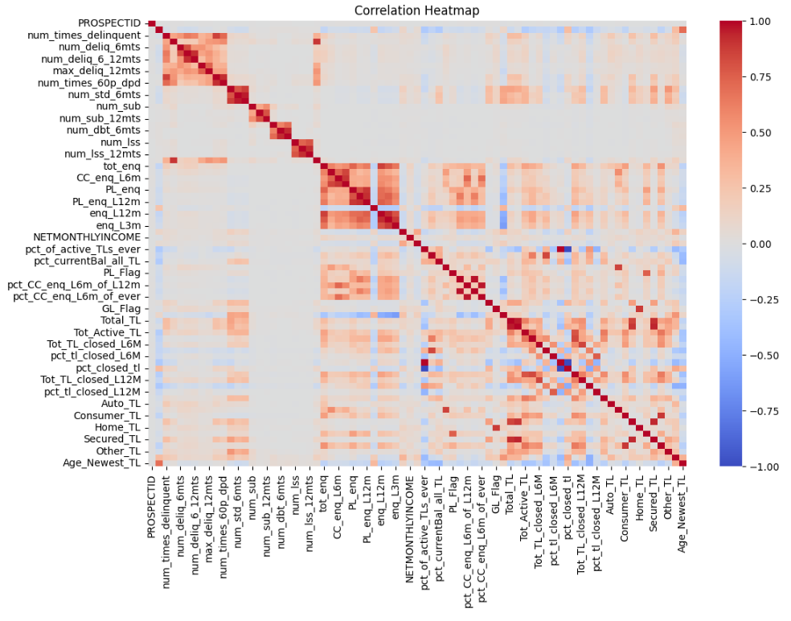

#### Distribution of Age
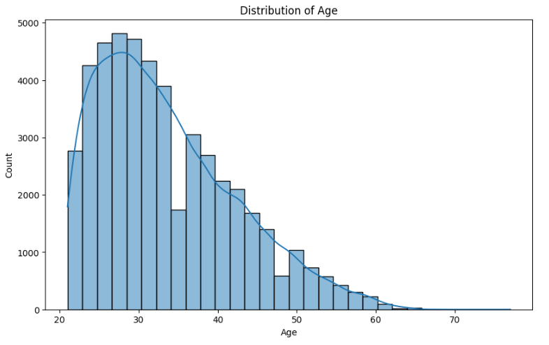

#### Distribution of Gender
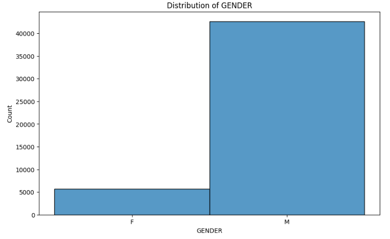

#### Distribution of Education
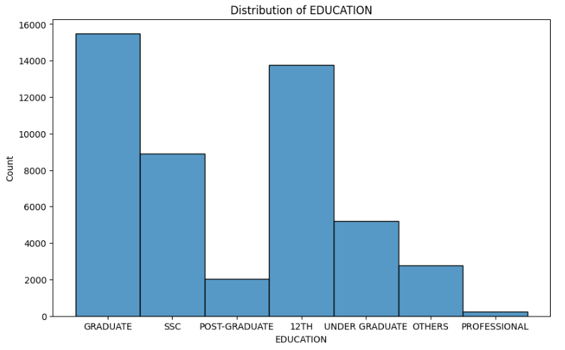

#### Distribution of Marital Status
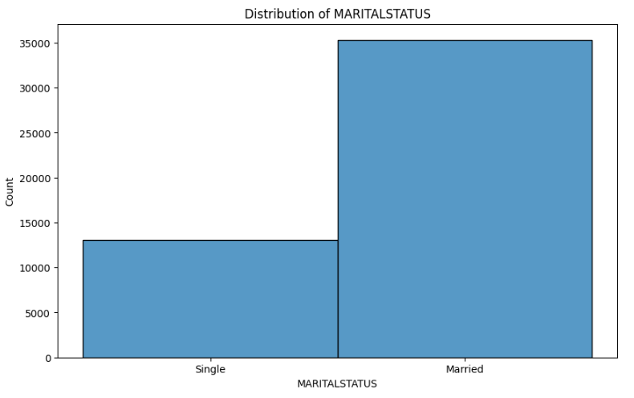

#### Distribution of Approved Flag
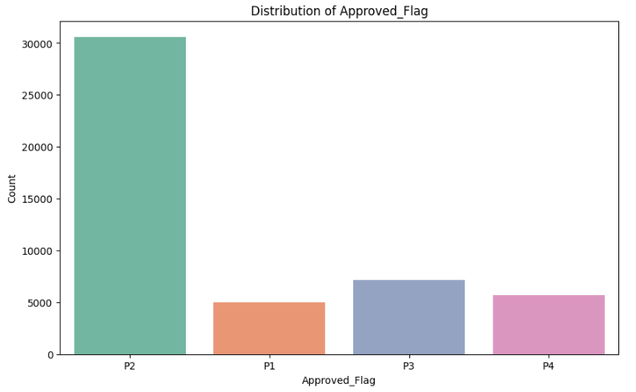

#### Distribution of Age_Newest_TL
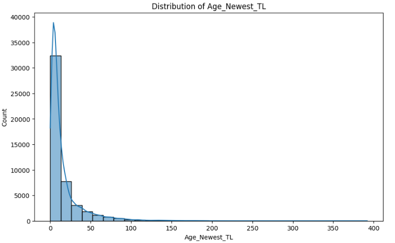

#### DIstribution of Oldest_Newest_TL
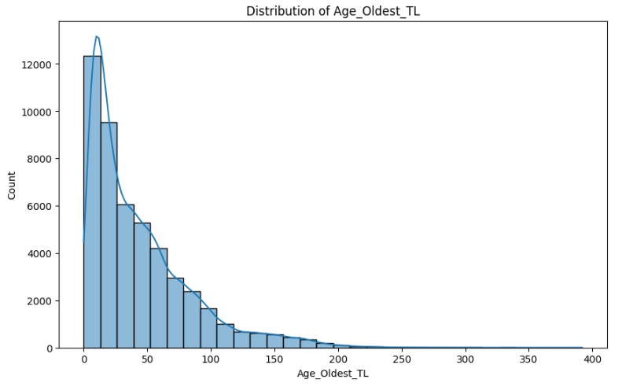

#### DIstribution of Credit Score
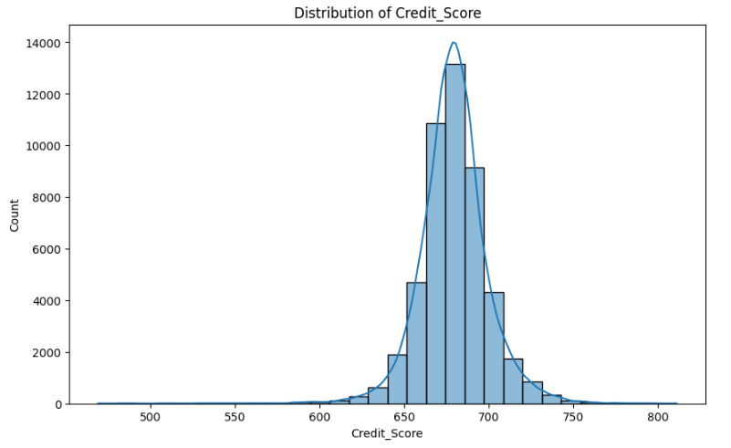

#### First Product Enquiry
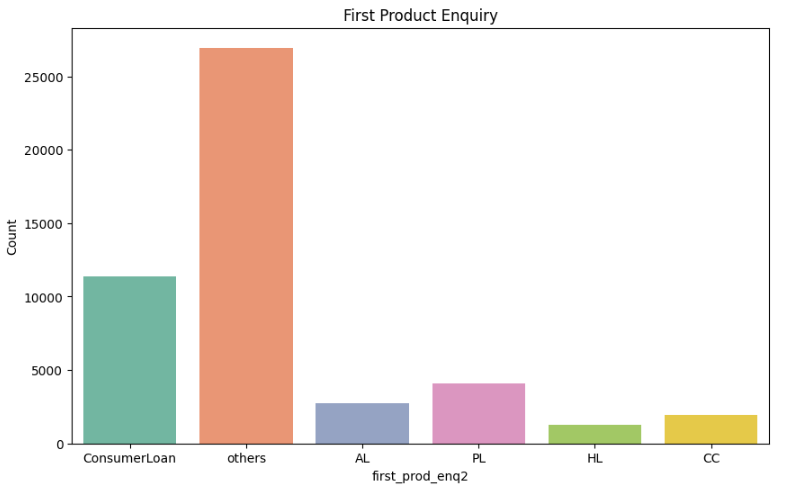

#### Statistics for Credit_Score with respect to Approved_Flag
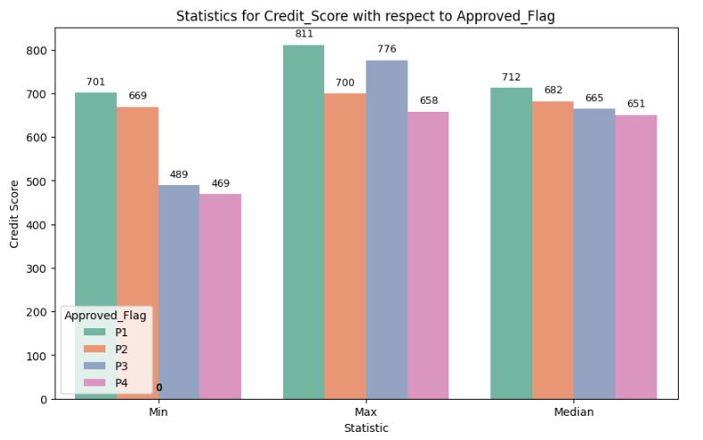

#### Statistics for Credit_Score with respect to Approved_Flag
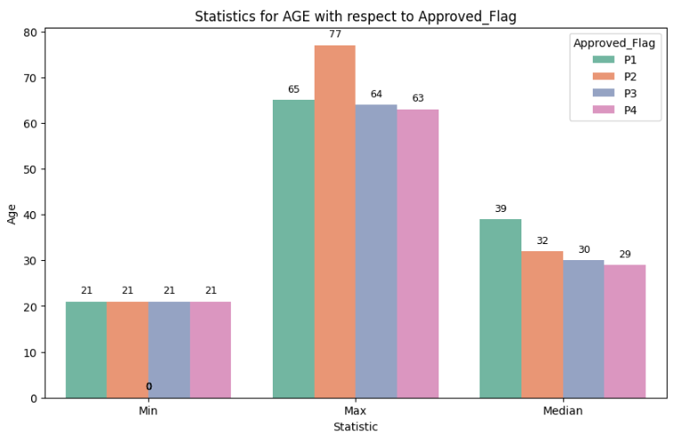

### Observations

- Credit Score shows the highest correlation with Approved_Flag
- Most loan applicants are working-age adults between the range 25–40
- More male applicated compared to female applicants
- Tradeline age visualizations reveal that low-risk individuals (P1/P2) often have longer credit histories